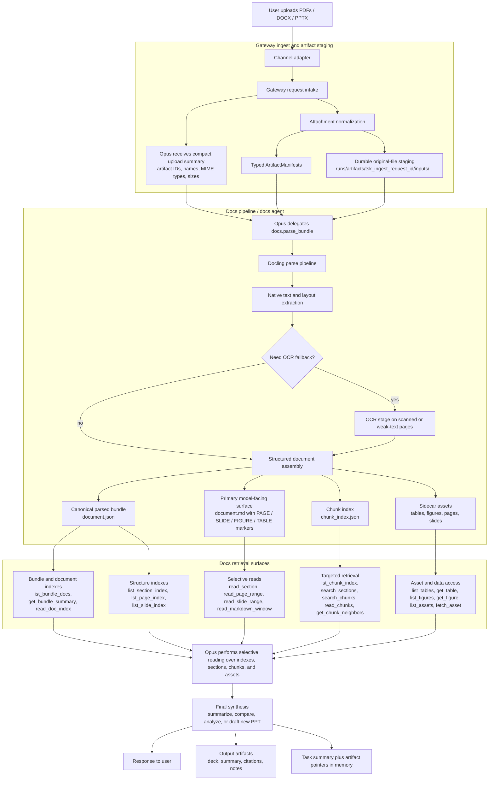
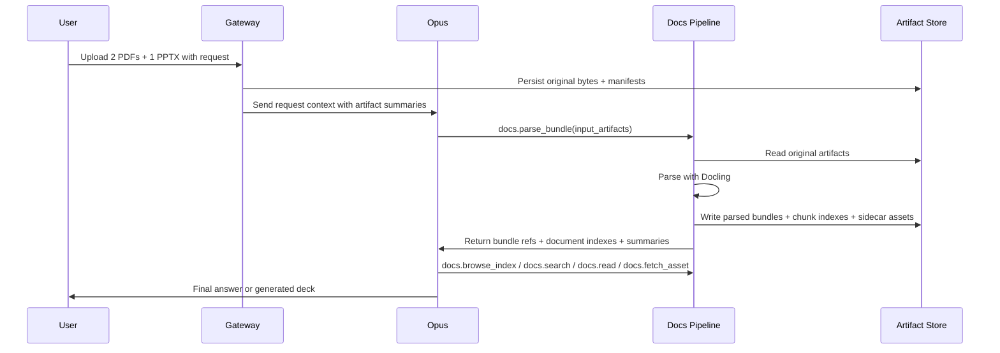
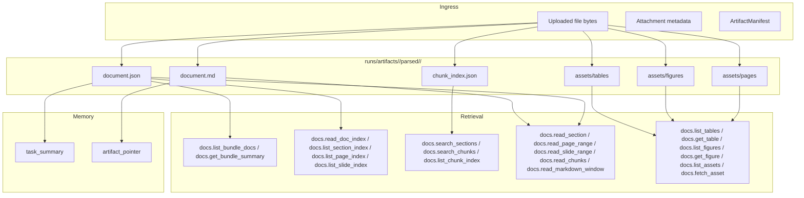

# COSMIC Multimodal Document Pipeline Plan

**Status:** Finalized implementation plan for the first production document pipeline  
**Scope:** PDFs, DOCX, PPTX, and image-bearing document workflows  
**Alignment:** Designed to fit the current COSMIC `input_artifacts` / artifact-manifest architecture in `cosmic_architecture.md`

---

## 1. Purpose

This document defines the end-to-end production design for COSMIC's document pipeline.

The goal is to let a user upload one or more documents in a single message, have COSMIC parse them into durable, structured artifacts, and then let Opus work over compact, cited retrieval surfaces rather than raw files or giant document dumps.

This plan is specifically for:

- PDFs
- DOCX
- PPTX
- mixed upload bundles such as "2 PDFs and 1 PPTX"
- downstream tasks such as summarization, comparison, research, and presentation generation

This plan is **not** an "OCR-only" pipeline. OCR is one stage inside a broader document ingestion system.

---

## 2. Core Decisions

### 2.1 Main Decisions

1. **Uploads become typed input artifacts.**
2. **Parsing is task-driven, not folder-driven.**
3. **A specialist docs pipeline owns document parsing.**
4. **Docling is the default parser.**
5. **OCR is a fallback stage, not the default strategy.**
6. **Opus does not read raw file paths directly.**
7. **Opus does not load full long documents by default.**
8. **Each uploaded file gets one canonical parsed-document bundle.**
9. **`document.json` is the canonical parsed truth.**
10. **`document.md` is the main model-facing readable surface.**
11. **Tables, figures, and page renders are sidecar assets referenced by stable IDs.**
12. **Large parsed outputs stay in artifacts, not in shared memory text.**

### 2.2 Explicit Non-Decisions

This design does **not** do any of the following:

- send every uploaded file directly to Opus using a file API by default
- run a blind global auto-parser over every artifact that appears anywhere under `runs/artifacts/`
- dump full parsed documents into prompt context
- make Opus manually stitch together separate table files and image files for normal tasks
- treat markdown as the only canonical representation of a parsed document

---

## 3. High-Level Architecture



### Ownership Boundaries

- **Gateway**
  - owns attachment ingress
  - owns initial artifact manifests
  - owns durable input-artifact staging

- **Docs pipeline / docs agent**
  - owns parsing
  - owns OCR fallback
  - owns parsed bundles
  - owns chunking and retrieval surfaces

- **Opus**
  - owns planning and synthesis
  - does not own raw parsing
  - does not own OCR
  - does not own direct filesystem crawling

---

## 4. End-to-End User Flow

Example user input:

> "Use these 2 PDFs and 1 PPTX to make me a new deck summarizing the key strategy changes."

### 4.1 Ingress

1. User uploads 3 files in one input.
2. Gateway normalizes the attachments.
3. Gateway persists:
   - attachment metadata
   - durable original-file bytes
   - one typed `ArtifactManifest` per file
4. Gateway adds compact upload metadata to the request context:
   - artifact IDs
   - filenames
   - MIME types
   - file sizes

### 4.2 Orchestration

5. Opus sees that uploaded files exist and that the task depends on document understanding.
6. Opus delegates a `docs.parse_bundle` task using the uploaded `input_artifacts`.
7. The docs pipeline parses all inputs and emits parsed bundles plus retrieval indexes.
8. Opus then uses docs retrieval tools to read only the relevant chunks, sections, tables, or figures.
9. If the user asked for a new deck, Opus either:
   - drafts the deck directly from retrieved content, or
   - delegates to a future presentation agent.

### 4.3 Completion

10. COSMIC returns:
   - the new PPTX or deck outline
   - citations to source pages/slides/sections
   - produced artifacts
11. The orchestrator writes a compact task summary and artifact pointers into memory, not the full parsed content.

---

## 5. Artifact Model

### 5.1 Input Artifact Rule

The uploaded originals must become immutable, typed input artifacts.

Opus should be told:

- "3 files were uploaded"
- what they are called
- what type they are
- their artifact IDs

Opus should **not** be told:

- arbitrary raw local paths
- ad hoc channel-specific download URLs
- direct filesystem browsing instructions

### 5.2 Output Artifact Rule

The docs pipeline emits task-scoped parsed outputs under a standard bundle shape.

### Original Upload Staging

To stay aligned with the current artifact-first architecture, the system should treat inbound uploads as an artifact-producing ingress scope.

Recommended shape:

```text
runs/artifacts/tsk_ingest_<request_id>/
  inputs/
    <artifact_id>/
      original/<safe_filename>
      manifest.json
```

This keeps the original uploads durable and traceable without mixing them into later parse-task outputs.

### Parsed Output Shape

For a docs parse task:

```text
runs/artifacts/<docs_parse_task_id>/
  parsed/
    <artifact_id>/
      manifest.json
      document.json
      document.md
      chunk_index.json
      assets/
        pages/
        figures/
        tables/
        slides/
```

---

## 6. Canonical Parsed-Document Bundle

Each uploaded document gets one canonical parsed bundle.

### 6.1 `document.json` - Canonical Truth

`document.json` is the system source of truth for the parsed result.

It should preserve:

- document metadata
- parser metadata
- page or slide boundaries
- block order
- headings
- paragraphs
- lists
- tables
- figures
- citations
- asset IDs
- original page and slide anchors

Use cases:

- exact retrieval
- structured table extraction
- image lookup
- page-level citations
- future reparsing or re-rendering

### 6.2 `document.md` - Primary Model-Facing View

`document.md` is the main human- and LLM-readable linearized surface.

It should contain the document in natural reading order, but with explicit markers for boundaries and assets.

Example:

```md
# Strategy Review

[PAGE 1]

Intro paragraph...

[TABLE id=tbl_001 asset_id=art_tbl_001 page=1 title="Revenue by region"]

More text...

[FIGURE id=fig_003 asset_id=art_fig_003 page=2 caption="Current architecture"]

[PAGE 2]

...
```

This lets Opus read one coherent text surface without losing references to tables, figures, and pages.

### 6.3 Sidecar Assets

Sidecar assets must exist for fidelity and later multimodal upgrades.

Examples:

- extracted table JSON / CSV / markdown blocks
- extracted figure images
- page renders
- slide renders

Opus should not normally fetch all of these individually. They exist for:

- exact retrieval
- citation
- future VLM inspection
- downstream specialist tasks

---

## 7. Pagination, Slides, and Long Documents

### 7.1 PDFs

PDFs must preserve explicit page markers.

In `document.md`:

- `[PAGE 1]`
- `[PAGE 2]`
- etc.

In `document.json`:

- every block stores its page number
- every table/figure stores its source page

### 7.2 PPTX

PPTX must preserve explicit slide markers.

In `document.md`:

- `[SLIDE 1]`
- `[SLIDE 2]`
- etc.

In `document.json`:

- each block stores its slide number
- each image/table stores its slide anchor

### 7.3 DOCX

DOCX page numbers are less reliable because pagination depends on rendering.

So the primary units for DOCX should be:

- heading hierarchy
- section boundaries
- paragraph blocks

If needed later, a rendered-page map can be produced as a secondary artifact, but section-based retrieval should be the default.

### 7.4 Long-Document Rule

Opus must **never** load an entire long `document.md` by default.

The correct flow is:

1. get outline
2. search relevant chunks
3. read only needed ranges
4. fetch tables or figures only on demand

This is mandatory for 100+ page documents.

---

## 8. Chunking and Retrieval Model

The parsed-document bundle must produce a chunk index.

The retrieval layer must be richer than a simple "search chunks and read chunks" interface. It should let Opus navigate by document, section, page, slide, chunk, table, figure, and local read windows without wasting context.

Recommended chunk signals:

- chunk ID
- token estimate
- page or slide anchor
- heading path
- artifact references inside the chunk
- nearby chunk links

Recommended stable structural IDs:

- `doc_id`
- `section_id`
- `block_id`
- `chunk_id`
- `table_id`
- `figure_id`
- `asset_id`

Where possible, these IDs should be content-stable so unrelated reparses do not cause the entire navigation surface to drift. This follows the same practical direction as the stable-ID idea in your `docs_agent.py` reference, but applied to parsed-document bundles rather than one live Google Doc.

### Retrieval Principle

The docs pipeline should expose retrieval over parsed content, not raw file reads.

Recommended read surfaces:

- bundle index
- document index
- section index
- page index
- slide index
- chunk index
- asset index
- outline
- section search
- chunk search
- chunk read
- table fetch
- figure fetch

### 8.1 Internal Selective Reading Contract

The internal docs retrieval contract should support all of the following:

| Surface | Endpoint / Intent | Purpose |
|---|---|---|
| Bundle docs | `docs.list_bundle_docs(bundle_id)` | List all parsed documents in a multi-file request |
| Bundle summary | `docs.get_bundle_summary(bundle_id)` | Give Opus a compact bundle-wide planning view |
| Document index | `docs.read_doc_index(doc_id)` | Return metadata, counts, available indexes, and parse stats |
| Section index | `docs.list_section_index(doc_id)` | List all sections with IDs, titles, hierarchy, and anchors |
| Page index | `docs.list_page_index(doc_id)` | List all PDF pages and coverage ranges |
| Slide index | `docs.list_slide_index(doc_id)` | List all PPT slides and slide summaries |
| Chunk index | `docs.list_chunk_index(doc_id)` | Enumerate chunk IDs and chunk metadata |
| Asset index | `docs.list_assets(doc_id, kind)` | Enumerate tables, figures, page renders, slide renders |
| Read section | `docs.read_section(section_id)` | Read one semantically coherent section |
| Read page range | `docs.read_page_range(doc_id, start_page, end_page)` | Read a bounded PDF page window |
| Read slide range | `docs.read_slide_range(doc_id, start_slide, end_slide)` | Read a bounded PPT window |
| Read markdown window | `docs.read_markdown_window(doc_id, anchor_id, before, after)` | Read a local window around a section, table, or figure marker |
| Search chunks | `docs.search_chunks(doc_ids, query, top_k)` | Retrieve the most relevant chunks across one or more docs |
| Search sections | `docs.search_sections(doc_ids, query, top_k)` | Retrieve relevant sections instead of tiny chunks |
| Read chunks | `docs.read_chunks(chunk_ids)` | Read exact chunks returned by search |
| Chunk neighbors | `docs.get_chunk_neighbors(chunk_id, radius)` | Expand local context without rerunning the full search |
| List tables | `docs.list_tables(doc_id)` | See all extracted tables with titles and page refs |
| Get table | `docs.get_table(table_id, format)` | Fetch exact structured table content |
| List figures | `docs.list_figures(doc_id)` | See all figures and captions |
| Get figure | `docs.get_figure(figure_id)` | Fetch figure metadata and linked asset info |
| Fetch asset | `docs.fetch_asset(asset_id)` | Fetch the actual referenced sidecar asset |

### 8.2 Preferred Tool Surface for Opus

The internal contract can be rich, but the model-facing tool surface should stay compact.

Recommended tools or agent intents:

- `docs.parse_bundle`
- `docs.browse_index`
- `docs.search`
- `docs.read`
- `docs.fetch_asset`

Where the compact tools support selector arguments such as:

- `index_kind=documents|sections|pages|slides|chunks|tables|figures|assets`
- `search_kind=sections|chunks`
- `read_kind=section|page_range|slide_range|chunk_ids|markdown_window`

Avoid giant tool surfaces like:

- `read_any_file_path`
- `load_full_document`
- `fetch_table_1_then_fetch_image_7_then_fetch_page_93` as the normal path

This gives COSMIC a beyond-industry-standard selective reading layer without bloating the prompt-visible tool catalog.

---

## 9. Parsing Strategy

### 9.1 Default Parser

Use **Docling** as the default parser for:

- PDF
- DOCX
- PPTX

### 9.2 Default Modes

Default production mode:

- native extraction first
- OCR fallback where text is weak or missing

Do **not** default to VLM mode for every document.

### 9.3 OCR Policy

OCR should be used:

- when a PDF is scanned
- when a page has no usable text layer
- when image regions require text extraction

OCR should **not** be the default strategy for born-digital documents.

### 9.4 Future VLM Policy

VLM analysis should be a later selective enhancement for:

- charts
- diagrams
- figure interpretation
- hard image-heavy pages

That later stage should operate on the sidecar assets already extracted by the docs pipeline.

---

## 10. Automatic Parsing vs Task-Driven Parsing

This is a critical design decision.

### Final Rule

**Automatically parse newly uploaded document inputs for the active request, but do not run a blind global parser over all artifacts under `runs/artifacts/`.**

That would be wrong for several reasons:

- `runs/artifacts/` will contain many kinds of outputs
- not every artifact is a document
- not every document needs full parsing immediately
- background auto-parsing would add cost and latency in the wrong place

### Correct Rule

Parsing should be **ingest-driven for current-turn uploaded documents** and **task-driven for older existing artifacts**:

- when a user uploads document-like files in the current request, Gateway should trigger the docs ingest / parse pipeline automatically
- Opus should then receive parsed bundle references and indexes instead of raw upload-only state
- if older artifacts need to be parsed later, that remains an explicit task decision rather than a filesystem watcher behavior

### Optional Optimization

Later, we may add a light "upload triage" step that:

- classifies uploaded files
- computes checksums
- stores byte-level metadata
- maybe creates a very small ingest manifest

But full parsing should still remain task-driven.

---

## 11. Detailed Sequence



---

## 12. Storage Architecture



---

## 13. Memory Integration

Parsed documents should **not** be dumped into shared memory as giant text blobs.

What should go to memory:

- task summary
- compact artifact pointer
- small durable facts derived from the task if relevant

What should stay in artifacts:

- full parsed markdown
- full JSON structure
- full tables
- page images
- figure assets

This is consistent with the current architecture rule that large outputs spill to artifacts, not prompt-visible memory text.

---

## 14. What Opus Sees

### 14.1 Initial Upload Turn

Opus should see a compact upload summary such as:

- `3 input documents uploaded`
- `Q1_strategy.pdf` (`application/pdf`)
- `product_notes.pdf` (`application/pdf`)
- `board_update.pptx` (`application/vnd.openxmlformats-officedocument.presentationml.presentation`)
- artifact IDs and brief sizes

### 14.2 After Parsing

Opus should receive:

- docs parse task completion
- parsed bundle references
- per-document top-level indexes
- maybe a small parse summary

Opus should then use retrieval tools rather than loading full bundles.

---

## 15. Docs Retrieval Design

### 15.1 Default Read Pattern

For long docs:

1. `docs.browse_index(index_kind="documents" | "sections" | "pages" | "slides")`
2. `docs.search(search_kind="sections" | "chunks", query=..., top_k=...)`
3. `docs.read(read_kind="section" | "page_range" | "slide_range" | "chunk_ids")`
4. optional `docs.fetch_asset(asset_id)`

### 15.2 Beyond-Industry-Standard Selective Reading

The retrieval layer should be strong enough that Opus can behave like a careful analyst rather than a blunt summarizer.

That means supporting all of the following patterns:

- list all documents in a bundle before choosing one
- read the document index before any large read
- list all sections and navigate by `section_id`
- list all pages or slides and navigate by numeric range
- search sections when semantic structure matters more than tiny chunk recall
- search chunks when the question is narrow and pinpointing matters
- expand chunk neighborhoods without rerunning the whole search
- read a markdown window around a table or figure marker
- list all tables and figures before fetching one
- fetch exact table data or figure assets only when needed
- preserve citations and page or slide anchors at every step

### 15.3 Asset Fetching

Annotation markers in `document.md` are **references**, not raw file instructions.

Example:

```md
[FIGURE id=fig_005 asset_id=art_fig_005 page=7 caption="System architecture"]
```

Opus does **not** infer a path from this.

Instead it calls:

- `docs.fetch_asset(asset_id="art_fig_005")`

or a similar docs-surface method.

### 15.4 Multi-Document Bundle Reading

For uploads like "2 PDFs and 1 PPTX", the retrieval layer must support bundle-first navigation.

Recommended bundle flow:

1. `docs.list_bundle_docs(bundle_id)`
2. `docs.get_bundle_summary(bundle_id)`
3. choose target docs
4. `docs.search_sections(doc_ids=[...], query=...)`
5. `docs.read_section(section_id)` or `docs.read_chunks(chunk_ids)`
6. fetch supporting tables or figures only if required

This avoids flattening all uploaded files into one giant merged text surface too early.

---

## 16. Presentation-Generation Workflow

For a future "make me a new PPT from these docs" flow:

1. ingest uploaded docs as input artifacts
2. parse bundle
3. search and read relevant sections
4. build a presentation brief
5. generate slide outline
6. create PPTX via a future presentation agent

The docs pipeline should not itself become the slides generator. It should produce clean retrieval surfaces for a later presentation workflow.

---

## 17. Observability and Logging

The document pipeline should log:

- artifact ingress
- parse start / completion
- parser used
- OCR used or not
- page count / slide count
- chunk count
- extracted figure count
- extracted table count
- parse latency
- retrieval latency
- asset-fetch latency
- failures by stage

Useful event types:

- `artifact.added`
- `task.progress`
- `task.completed`
- docs-specific progress such as:
  - `Parsing uploaded documents...`
  - `Extracting text from PDF...`
  - `Building document chunks...`
  - `Extracting tables and figures...`

---

## 18. First Implementation Milestones

### 18.1 Phase 1

- durable original upload storage
- `ArtifactManifest` alignment for uploaded files
- docs parse task
- Docling default parser
- canonical parsed bundle shape
- chunk index
- minimal docs retrieval surface

### 18.2 Phase 2

- OCR fallback improvements
- stronger table extraction
- figure extraction and page rendering
- better outline and chunk ranking

### 18.3 Phase 3

- selective VLM augmentation on figures/charts
- presentation agent integration
- cross-document comparison workflows

---

## 19. Final Answers to the Key Design Questions

### Should uploaded docs go into artifacts?

**Yes.** They should become typed, durable input artifacts.

### Should Opus just be told file locations?

**No.** It should be told artifact summaries and IDs, not arbitrary filesystem paths.

### Should we have tools for Opus to fetch parsed content?

**Yes.** But keep them small and retrieval-oriented, not raw-file oriented.

### Should anything in the artifacts folder auto-trigger parsing?

**No.** Parsing must be task-driven.

### Should we have one main doc surface instead of making Opus stitch images and tables manually?

**Yes.** `document.md` is the primary readable surface, with stable in-place asset markers.

### Is markdown alone enough?

**No.** `document.json` must remain the canonical parsed truth.

### How do we handle 200-page docs?

With:

- chunked retrieval
- outline-first reads
- selective section loading
- explicit page markers

not by loading the full doc into context.

---

## 20. Final Recommended Production Shape

The finalized production plan is:

- **Gateway-owned upload ingress**
- **typed immutable input artifacts**
- **task-driven docs parsing**
- **Docling-first parsing**
- **OCR fallback**
- **one canonical parsed bundle per document**
- **`document.json` as truth**
- **`document.md` as model-facing read surface**
- **chunk index + small docs retrieval tools**
- **sidecar assets for figures/tables/page renders**
- **task-scoped parsed outputs**
- **memory stores only compact task summaries and artifact pointers**

This is the right multimodal document pipeline for COSMIC.
