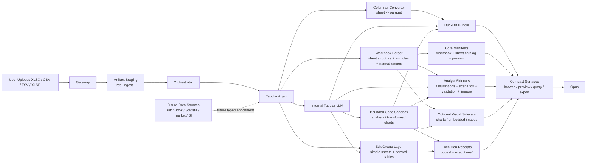

# COSMIC Tabular Spreadsheet Pipeline Plan

**Status:** Implementation-ready architecture and rollout plan for COSMIC spreadsheet handling  
**Scope:** `XLSX`, `CSV`, `TSV`, `XLSB`, and spreadsheet-adjacent analytical workflows  
**Alignment:** Designed to fit the current COSMIC `input_artifacts` / artifact-manifest / specialist-agent architecture in `cosmic_architecture.md`

---

## 1. Purpose

This document defines the production design for COSMIC's tabular and spreadsheet pipeline.

The goal is to let a user upload spreadsheets and delimited data files, have COSMIC convert them into durable structured compute artifacts, and then let Opus work over deterministic analytical surfaces rather than treating spreadsheets like plain documents.

The pipeline should also support higher-level spreadsheet work such as:

- analysis
- sheet management
- derived-table creation
- safe workbook edits
- reusable code-backed analytical workflows inside the spreadsheet specialist
- financial-analysis workflows over structured workbook artifacts

This plan is specifically for:

- `XLSX`
- `CSV`
- `TSV`
- `XLSB`
- multi-sheet analytical workbooks
- operational tables, financial models, CRM exports, growth dashboards, and planning sheets
- downstream tasks such as:
  - summaries
  - filtering
  - aggregation
  - joins
  - comparisons
  - formula inspection
  - variance analysis
  - driver analysis
  - scenario comparison
  - sensitivity analysis
  - KPI rollups
  - export of cleaned/derived tables

This plan is **not** an extension of the docs parser. Spreadsheet handling is a separate tabular pipeline with its own specialist agent, artifacts, and compute model.

---

## 2. Core Decisions

### 2.1 Main Decisions

1. **Spreadsheets do not flow through the docs parser by default.**
2. **A dedicated tabular specialist owns spreadsheet ingestion and query.**
3. **Gateway stages spreadsheet uploads as typed input artifacts, then dispatches a tabular parse task.**
4. **The canonical compute surface is columnar, not workbook-native.**
5. **Each sheet/tab becomes its own queryable artifact surface.**
6. **Workbook semantics and compute semantics are stored separately.**
7. **Opus does not do spreadsheet math from raw text when a deterministic query path exists.**
8. **Formula text is preserved exactly; recalculation is a separate concern.**
9. **Charts, images, and embedded visual objects are sidecar assets, not the primary analytical truth.**
10. **Long-running spreadsheet work should return compact previews and query handles, not dump giant tables into prompt context.**
11. **The tabular specialist may use an internal LLM with a sandboxed code tool as a first-class internal capability.**
12. **Any generated analysis code must be persisted as part of the task artifact bundle for audit, reuse, and reproducibility.**
13. **If LangGraph/LangChain is used for the tabular-agent workflow, the code tool should still be COSMIC's own bounded sandbox executor exposed through that workflow layer, not a stock unrestricted REPL.**
14. **The tabular specialist should be able to behave like a compact financial analyst: inspect formulas, trace drivers, validate outputs, compare scenarios, and create simple derived sheets without forcing Opus to reason over raw workbook state.**
15. **For current-turn spreadsheet uploads, Opus should receive the user query only after the initial tabular parse completes and compact workbook handles are available in the working set.**
16. **The tabular pipeline should parallelize work where safe: across independent files, across independent sheets during parse/profiling, and across bounded visual/code tasks, while keeping deterministic artifact ownership.**

### 2.2 Explicit Non-Decisions

This design does **not** do any of the following:

- treat spreadsheets as markdown-first documents
- rely on LLM reasoning for arithmetic, grouping, or joins
- pretend that cached Excel formula values are equivalent to live recalculation
- expose raw file paths to Opus
- force every workbook through LibreOffice or a visual pipeline by default
- make the spreadsheet specialist an unbounded notebook-like runtime exposed directly to Opus
- make OpenAI Code Interpreter or a stock LangChain Python REPL the primary execution substrate

### 2.3 Initial Format Scope

The first production slice should support:

- `XLSX`
- `CSV`
- `TSV`
- `XLSB`

Deferred formats:

- `XLS`
- `ODS`
- password-protected/encrypted workbooks
- macro-enabled workflows as an execution surface

---

## 3. Why This Is A Separate Pipeline

Documents and spreadsheets have different truth models.

Documents are primarily:

- ordered reading surfaces
- sections
- pages
- figures
- citations

Spreadsheets are primarily:

- tabular datasets
- workbook/sheet structure
- column types
- formulas
- deterministic query operations

Because of that:

- the docs parser should own `PDF/DOCX/PPTX`
- the tabular pipeline should own `XLSX/CSV/TSV/XLSB`

This separation keeps:

- retrieval surfaces clean
- compute deterministic
- prompts smaller
- execution semantics honest

---

## 4. High-Level Architecture



---

## 5. Specialist Ownership

The spreadsheet pipeline should be implemented as a dedicated specialist agent.

Recommended agent identity:

- `cosmic/tabular-agent:1.0.0`

Recommended responsibilities:

- parse workbook/file structure
- normalize sheet values into deterministic tabular artifacts
- preserve workbook metadata and formulas
- expose safe edit/manage/create operations over workbook-derived artifacts
- expose compact browse/preview/query/export intents
- use a sandboxed code tool internally for analytical work that exceeds the built-in query surface
- support analyst-style tasks such as assumptions inspection, driver tracing, variance analysis, and scenario comparison
- create simple sheets and derived tables through durable artifact-backed operations
- optionally extract chart/image sidecars
- optionally perform workbook recalculation in a later phase

This agent should follow the normal COSMIC runtime contract:

- Redis task envelopes
- agent card registration
- usage logging to Gateway
- artifact persistence under `runs/artifacts/<task_id>/...`
- recall support for prior runs
- produced user-facing files should follow the same COSMIC produced-artifact delivery contract as other specialists

---

## 6. Runtime and Orchestration Contract

This section is intentionally explicit so a new implementer can build the tabular specialist without having to infer COSMIC runtime behavior from other docs.

### 6.1 Registry Registration

The tabular specialist should register like any other COSMIC specialist agent:

- it should have an `agent_card.yaml`
- it should register itself in the live registry through the normal agent runtime
- it should publish heartbeats so the orchestrator can discover healthy instances
- it should expose a stable agent identity such as:
  - `cosmic/tabular-agent:1.0.0`

The registry-facing contract should include:

- agent id
- display name
- intent list
- health / healthy-instance state
- any prompt-visible summary or description needed for curated shortlist display

The registry remains the source of truth for live specialist discovery. Any future curated Opus-facing wrappers are only convenience surfaces on top of that source of truth.

### 6.2 Redis and AgentRuntime Contract

The tabular specialist should use the same Redis/AgentRuntime contract as other COSMIC specialists.

That means:

- consume normal COSMIC `TaskEnvelope`s from the assigned specialist stream
- emit progress and terminal events through the normal COSMIC event path
- publish heartbeats through the normal registry/runtime path
- avoid any custom side-channel for orchestrator-specialist communication

The implementation should look like other COSMIC specialists operationally:

- Redis Streams for task transport
- normal agent runtime registration and heartbeat behavior
- normal task progress events during long-running work
- normal terminal result event when parse/query/export work completes
- normal retry / failure behavior defined by the runtime and agent card

The tabular specialist should not invent a spreadsheet-specific transport or bypass the shared runtime contract.

### 6.3 Orchestrator Interaction

The tabular specialist should communicate with the orchestrator through normal COSMIC `TaskEnvelope` flow.

Required rules:

- Gateway stages spreadsheet artifacts and dispatches a parent tabular parse task
- orchestrator dispatches the specialist using normal Redis task-envelope mechanics
- child tasks inherit:
  - `session_id`
  - `source`
  - `source_id`
  - `channel`
- follow-up tabular tasks use their own `task_id` and keep `parent_task_id`

The first required specialist intent is:

- `tabular.parse_bundle`

Expected follow-on intents should include:

- `tabular.browse_workbook`
- `tabular.schema_sheet`
- `tabular.preview_sheet`
- `tabular.query_workbook`
- `tabular.export_result`
- later:
  - `tabular.trace_formula`
  - `tabular.validate_workbook`
  - `tabular.compare_scenarios`
  - `tabular.create_sheet`
  - `tabular.edit_workbook`

Opus should reach this specialist through the normal COSMIC orchestration model:

- either curated first-class wrappers for common tabular actions
- or live discovery through `agent_catalog_search` plus delegation

But the authoritative execution path is always specialist-task dispatch, not direct raw workbook reasoning inside Opus.

Pre-query gating rule for current-turn uploads:

- when a user uploads spreadsheet-native files and asks a question in the same turn, Gateway should stage and dispatch `tabular.parse_bundle` first
- Opus should not be asked to answer against those spreadsheet files until the tabular specialist has returned a compact parse-completion payload
- once parse completes, Gateway enriches the active working set with workbook handles and then Opus receives the user query over that typed surface

This mirrors the current document pipeline pattern and keeps Opus out of raw workbook state.

Produced file rule:

- if the tabular specialist creates a user-facing file such as an exported workbook, derived CSV/XLSX, scenario pack, or chart bundle, it must return compact produced-artifact descriptors on the parent result
- only artifacts marked `audience=deliverable` should appear in the default Produced Files UI
- internal scrape/query/parse byproducts should be marked `audience=supporting` or `audience=debug` and stay hidden unless explicitly requested
- Gateway should persist those descriptors in assistant-message metadata
- desktop should render those as downloadable output-file cards
- delivery should stay artifact-first and Gateway-owned rather than exposing raw bundle paths to the user

### 6.4 Usage Ledger Contract

All LLM and tool-backed work inside the tabular specialist should log usage to Gateway's append-only usage ledger.

That means:

- usage events should land in Gateway's `usage.db`
- events should carry normal COSMIC provenance fields such as:
  - `task_id`
  - `parent_task_id` when available
  - `session_id`
  - `source`
  - `source_id`
  - `channel`
- token usage should be logged for internal LLM calls
- cost should be logged when provider pricing or direct provider-reported cost is available

If the tabular specialist uses the sandboxed code tool, execution receipts should remain separate from token/cost usage events:

- code execution audit belongs in `codes/` and `executions/`
- model/tool usage telemetry belongs in Gateway's usage ledger

This separation keeps:

- runtime spend/accounting visible in Spaces Manage and other Gateway-backed dashboards
- execution audit and replay visible in the spreadsheet artifact bundle

### 6.5 Parse and Tool Handoff Back To Opus

The orchestrator-facing return contract should be compact.

The tabular specialist should return:

- a compact parse completion payload for `tabular.parse_bundle`
- compact result payloads for browse/schema/query/export intents
- stable artifact handles and sidecar refs instead of dumping workbook state into prompt context

This keeps Opus clean while still letting it coordinate rich spreadsheet work through the specialist.

The tabular specialist should also expose compact status semantics that Opus and the UI can trust, such as:

- `staged`
- `parsing`
- `parsed`
- `parsed_with_warnings`
- `partial_parse`
- `invalid_input`
- `parse_failed`

These statuses should be reflected in task events, parse-completion payloads, and artifact manifests so Opus can confirm what happened instead of guessing.

---

## 7. Recommended Technical Stack

### 7.1 Ingestion / Workbook Semantics

Use a workbook-aware parser for:

- sheet names
- hidden sheets
- row/column bounds
- formulas
- named ranges
- comments
- cell-level workbook metadata where available

The parser must also handle messy real-world workbook structure explicitly.

Required ingestion behaviors:

- detect the actual data rectangle, not assume row 1 / column A is the header
- tolerate title rows, blank rows, footnotes, and banner rows above the table
- detect multi-row headers when practical
- preserve enough header metadata to explain how column names were inferred
- warn when one sheet appears to contain multiple disjoint tables

### 7.1a Header Detection and Data Boundaries

Header detection is a first-class requirement, not an implementation detail.

The tabular agent should explicitly decide for each sheet:

- where the primary data region starts
- which row(s) form the header
- whether the sheet appears to contain:
  - one main table
  - multiple disjoint tables
  - a layout sheet with no stable tabular region

The system should persist boundary-detection results and warnings rather than silently flattening the whole tab.

At minimum, `sheet_catalog.json` or a sheet-level profile should record:

- detected header row index
- detected data start row
- detected data end row when bounded
- whether multi-row header consolidation was applied
- whether multiple-table detection triggered a warning

### 7.1b Merged Cells Policy

Merged cells are common in planning sheets and financial models.

The tabular agent must define a clear merged-cell policy when converting to deterministic table surfaces:

- preserve the original merged-cell metadata in workbook-aware sidecars
- never silently pretend merged structure did not exist
- when building a tabular compute surface, either:
  - replicate/forward-fill header values when that is clearly part of header normalization, or
  - keep nulls in data rows and emit a warning if merged cells make the data ambiguous

The policy should favor correctness and explicit warnings over aggressive guesswork.

### 7.1c CSV / TSV Sniffing

`CSV` and `TSV` are first-class inputs and need explicit sniffing behavior.

The parser should detect or validate:

- file encoding (`UTF-8`, `UTF-8 with BOM`, `Windows-1252`, `Latin-1`, etc.)
- delimiter (`comma`, `tab`, `semicolon`, `pipe`) when not fixed by file type
- quote character and escape behavior
- line ending style

If the parser has to fall back to a best guess, that fact should be surfaced in warnings.

### 7.2 Columnar Compute Surface

Convert every usable sheet into a columnar table surface:

- one sheet -> one `.parquet` artifact

This gives:

- fast reads
- clean typing
- partial reloads
- deterministic querying
- strong downstream compatibility

Recommended default parquet codec:

- use `zstd` when available for better storage efficiency
- fall back to `snappy` if ecosystem compatibility demands it

The chosen codec should be stable and documented so derived artifacts are consistent across runs.

### 7.3 Query Engine

Use one deterministic SQL-capable execution layer for:

- filtering
- aggregation
- joins
- grouping
- comparisons
- export of derived views

The intended bundle-level query surface should be a DuckDB-backed workbook bundle.

Concurrency policy:

- after parse completes, the canonical bundle should be treated as read-mostly / read-only for query work
- follow-up query tasks should open read connections, not mutate the canonical bundle in place
- write-oriented work should produce explicit derived artifacts, exported tables, or follow-up task outputs rather than in-place ad hoc mutation

This keeps DuckDB concurrency behavior simple and aligned with COSMIC's task/artifact model.

Parallelism policy:

- parallelize across independent uploaded files when they belong to the same parse bundle
- parallelize independent per-sheet profiling / schema work when safe
- keep bounded concurrency for any heavier code or visual enrichment work
- never allow parallelism to blur artifact ownership, task ownership, or execution receipts

Recommended first implementation:

- bounded file-level parallel parse
- bounded sheet-level profiling concurrency
- explicit semaphores around heavier optional work

### 7.4 Internal LLM and Code Sandbox

The tabular specialist should have its own internal LLM.

That internal LLM should not replace deterministic table operations. It should sit above them and decide:

- which sheet/schema tools to call
- when a deterministic query is enough
- when sandboxed code is appropriate
- how to summarize or export the result back to Opus

The sandboxed code tool should be a **first-class internal tool**, not merely an emergency fallback.

If the tabular agent is implemented with LangGraph/LangChain, that can be a good fit for workflow composition and internal tool routing.

But the code-execution layer should still be **COSMIC's own bounded executor** surfaced as a LangChain/LangGraph tool, rather than:

- a stock unrestricted LangChain Python REPL
- OpenAI Code Interpreter as the primary execution path
- an unstructured long-lived notebook kernel

Good uses of the code tool:

- custom analytical logic
- derived-table construction
- statistical transforms
- multi-step cleanup
- custom chart generation
- one-off model-driven transforms over already-parsed sheet data

Rules:

- code execution stays inside the tabular specialist
- Opus does not receive a raw REPL
- code must run against typed workbook artifacts, not arbitrary filesystem wander
- code outputs must be persisted into task artifacts

### 7.5 Sandbox Design

The code sandbox should be designed as a bounded execution worker with a stable COSMIC contract.

Recommended first version:

- one isolated Python worker process per execution
- one per-execution temp workspace
- strict runtime timeout
- bounded memory / CPU where practical
- no arbitrary outbound network by default
- read access only to the parsed workbook bundle and allowed helper inputs
- write access only to allowed output folders inside the artifact bundle

Recommended later version:

- keep the same tool contract
- optionally swap the worker backend to ephemeral containers for stronger isolation

So the architecture should be **containerizable later**, but **not Docker-required in v1**.

### 7.6 Code Tool Contract

Every sandboxed execution should follow this sequence:

1. the tabular specialist decides that code execution is appropriate
2. COSMIC creates an `execution_id`
3. the generated script is persisted first under `codes/<execution_id>.py`
4. COSMIC creates an execution record with:
   - workbook refs
   - sheet/table refs
   - requested goal
   - resource limits
5. the bounded worker runs the script in the sandbox
6. COSMIC persists the receipt under `executions/<execution_id>.json`

That receipt should include:

- script path
- input refs
- output refs
- exit status
- stdout/stderr handles or summaries
- runtime duration
- resource-usage summary when available
- any derived artifact ids/paths produced by the run

### 7.7 Optional Recalc / Render Layer

Do **not** make workbook recalculation mandatory in v1.

Instead:

- preserve formula text
- preserve cached displayed values when present
- add a future optional recalculation path for workbooks that need true formula recomputation or rendered charts

---

## 8. Artifact Model

For each parsed workbook or spreadsheet file, COSMIC should persist a canonical parsed bundle in the same overall artifact style as the document pipeline:

```text
runs/artifacts/req_ingest_<request_id>/
  inputs/
    <artifact_id>/
      original.xlsx
      manifest.json
```

Then the tabular parse task should create a task-scoped parsed bundle like:

```text
runs/artifacts/<tabular_parse_task_id>/parsed/
  <artifact_id>/
    manifest.json
    workbook_manifest.json
    sheet_catalog.json
    assumptions.json              # optional / phase-gated
    scenarios.json                # optional / phase-gated
    validation_report.json        # optional / phase-gated
    dependency_graph.json         # optional / phase-gated
    preview.md
    formulas.json
    named_ranges.json
    visual_index.json             # optional / phase-gated
    bundle.duckdb
    generated/
      <workbook_filename>.xlsx    # optional: created/exported workbook returned to user
    sheets/
      <sheet_id>.parquet
      <sheet_id>_profile.json
      <sheet_id>_preview.md
    codes/
      <execution_id>.py
    executions/
      <execution_id>.json
    assets/
      charts/
      images/
    intermediate/
      normalized_input/
```

### 8.1 Identity and Provenance Contract

This spreadsheet pipeline must follow the same COSMIC identity model as the core architecture.

Every implementation should treat the following identifiers as distinct and non-interchangeable:

- `session_id`
- `request_id`
- `task_id`
- `parent_task_id`
- `artifact_id`
- `execution_id`
- `source`
- `source_id`
- `channel`

These fields mean:

- `session_id`
  - the conversational/session continuity id
  - shared across turns in the same user conversation
  - used for recall, follow-up understanding, and session-scoped state
- `request_id`
  - the ingress/request correlation id for a specific user send
  - used to create request-scoped staging like `req_ingest_<request_id>`
- `task_id`
  - the owning execution id for a specific specialist task
  - used for task-scoped parsed/output bundles like `runs/artifacts/<task_id>/...`
- `parent_task_id`
  - the direct parent in the task tree
  - used when one tabular task spawns a follow-up parse/query/edit/export/code execution task
- `artifact_id`
  - the stable identity of one uploaded file/artifact within ingress and parsed storage
- `execution_id`
  - the identity of one internal sandbox/code execution inside the tabular specialist
- `source`
  - the high-level origin type from the TaskEnvelope, such as `user`, `cron`, `webhook`, `heartbeat`, or `hook`
- `source_id`
  - the origin-specific identifier carried on the TaskEnvelope
- `channel`
  - the originating delivery channel such as `desktop:<device_id>`, `whatsapp:+...`, or `telegram:chat_<id>`

The required propagation rules are:

1. Gateway creates request-scoped staging under `req_ingest_<request_id>`.
2. The tabular parse task inherits `session_id`, `source`, `source_id`, and `channel` from its parent TaskEnvelope.
3. The parsed workbook bundle is owned by the parse task's `task_id`.
4. Any follow-up tabular task, including code execution, edit, export, or recalc, should get its own `task_id` and keep a `parent_task_id` link back to the originating tabular task.
5. `artifact_id` remains the stable file identity across request staging and parsed/task outputs.
6. `execution_id` identifies an internal analytical code run inside the specialist; it does not replace `task_id`.

A new implementer should use this mental model:

- `request_id` answers: "which user send did this file arrive with?"
- `session_id` answers: "which ongoing conversation does this belong to?"
- `task_id` answers: "which specialist execution owns this parsed/output bundle?"
- `parent_task_id` answers: "which prior task spawned this follow-up task?"
- `artifact_id` answers: "which uploaded workbook/file is this?"
- `execution_id` answers: "which internal code run produced this derived result?"

### 8.2 Canonical Files

`manifest.json`

- task-level bundle metadata
- `session_id`
- `request_id` when known from ingress provenance
- owning `task_id`
- `parent_task_id` when this bundle was produced by a follow-up task
- `source`
- `source_id`
- `channel`
- input artifact refs
- parse status
- feature flags used
- execution summaries and generated-code refs when present

`workbook_manifest.json`

- workbook-level facts
- filename
- format
- sheet count
- visible sheet count
- hidden sheet count
- workbook warnings

`assumptions.json`

- extracted or user-declared assumption cells/tables when identified
- named assumptions with stable ids
- units / scale / currency hints when known
- scenario membership when applicable

`scenarios.json`

- baseline / upside / downside or user-defined scenario sets
- scenario inputs
- scenario outputs / key comparisons when computed

`validation_report.json`

- tie-out checks
- missing-value warnings
- inconsistent-unit warnings
- broken-reference warnings
- analyst-facing trust notes

`dependency_graph.json`

- formula lineage / driver graph when derived
- upstream/downstream relationships for important outputs
- references to sheets, ranges, named ranges, and cells when available

`sheet_catalog.json`

- one entry per sheet/tab
- display name
- `sheet_id`
- row count
- column count
- inferred column names
- inferred types
- hidden / visible state
- header/data-boundary detection summary
- multi-table warning state when applicable
- merged-cell warning state when applicable

`<sheet_id>_profile.json`

- per-sheet profile for the tabular compute surface
- basic row/column statistics
- inferred type distribution
- sparsity / null-density hints
- header-detection summary for that specific sheet
- warnings specific to that sheet

`formulas.json`

- preserved formula entries
- formula text
- cell/range references
- cached value state

`named_ranges.json`

- workbook named ranges
- target sheet/range refs
- workbook-level names useful for formulas, assumptions, and financial-model navigation

`visual_index.json`

- one entry per extracted visual object
- `asset_id`
- `asset_kind` such as `chart`, `image`, or `drawing`
- `sheet_id`
- `sheet_name`
- anchor metadata:
  - start cell
  - end cell when known
  - row/column offsets when available
- optional source data refs for charts when extractable
- optional linked VLM analysis ids when enrichment has been run

`bundle.duckdb`

- deterministic query surface over the workbook bundle

`preview.md`

- model-facing overview of the workbook
- workbook summary
- sheet list
- notable tabs
- formula-heavy tabs
- obvious anomalies/warnings
- partial-parse warnings when any sheets were skipped or degraded

`intermediate/normalized_input/`

- optional normalized staging outputs used before final columnar persistence
- only for implementation needs such as cleaned temporary tables, normalized CSV reads, or workbook-to-tabular normalization artifacts
- this folder is not a primary model-facing surface and should not become a dumping ground for arbitrary temp files

### 8.3 Code and Execution Artifacts

If the internal tabular LLM uses the sandboxed code tool, COSMIC should persist:

- the generated code file under `codes/`
- an execution receipt under `executions/`
- input sheet/table refs used by that execution
- output artifact refs produced by that execution

Example:

```text
codes/exec_20260322_01.py
executions/exec_20260322_01.json
```

Each execution receipt should include at minimum:

- `execution_id`
- owning `task_id`
- `parent_task_id` when applicable
- `session_id`
- `artifact_id`
- input refs
- output refs
- exit status
- runtime summary
- code path
- source/channel provenance inherited from the owning task when useful for audit

This is important for:

- auditability
- reuse across turns
- replayability
- debugging bad outputs
- letting the specialist build on prior successful analytical scripts

These code and execution artifacts should follow the same design philosophy as the document pipeline's cached analysis artifacts:

- durable inside the parsed task-scoped bundle
- scoped to the owning task/artifact
- reusable by later specialist recall or follow-up tasks
- never dumped wholesale into Opus context by default

### 8.4 Parquet Per Sheet

Every sheet should become a separate `.parquet` file.

Example:

```text
sheets/summary.parquet
sheets/revenue_forecast.parquet
sheets/team_plan.parquet
```

This does **not** replace workbook semantics. It only defines the best compute/query surface for tabular values.

### 8.5 Formula Sidecars

Formula preservation should be explicit:

- original formula text
- cell address
- cached displayed value if present
- whether the value is cached/stale/unknown

This prevents COSMIC from pretending it recomputed a workbook when it only read the last saved value.

---

## 9. Query and Retrieval Surface

Opus should not receive raw workbook dumps. It should get compact tabular tools.

Recommended first tool surface:

- `sheets_browse`
- `sheets_schema`
- `sheets_preview`
- `sheets_query`
- `sheets_export`
- `sheets_export_sheet`
- `sheets_create_workbook`

Recommended expanded financial-analysis surface after the core browse/query layer is stable:

- `sheets_trace_formula`
- `sheets_validate`
- `sheets_compare_scenarios`
- `sheets_create_sheet`
- `sheets_edit`
- `sheets_create_derived_table`

Inside the specialist, these should be complemented by internal tools such as:

- schema inspection
- query execution
- artifact export
- sandboxed code execution
- validation checks
- dependency/lineage extraction
- assumptions/scenario handling
- optional chart/image fetch

Opus should stay on the compact public tabular surface. The richer internal tool stack belongs to the tabular agent, not to Opus directly.

### 9.1 `sheets_browse`

Purpose:

- inspect workbook/sheet structure without loading big tables

Typical outputs:

- workbook summary
- sheet catalog
- formula-heavy sheets
- hidden sheets
- column summaries

### 9.2 `sheets_schema`

Purpose:

- return the typed schema of one sheet or workbook-local table surface without dumping rows

Typical outputs:

- column names
- inferred types
- nullability hints
- distinct-count / cardinality hints when cheap
- detected header row / data start row
- warnings about merged cells, sparse columns, or multi-table ambiguity

### 9.3 `sheets_preview`

Purpose:

- show a bounded human/model-readable preview of one sheet

Typical outputs:

- first rows
- key columns
- sheet summary
- warnings about sparse or malformed columns

### 9.4 `sheets_query`

Purpose:

- deterministic filtered/aggregated queries over the workbook bundle

Typical outputs:

- row subsets
- grouped summaries
- joins between tabs
- top/bottom values
- anomaly checks

### 9.5 `sheets_export`

Purpose:

- persist a derived result table back to artifact storage

Typical outputs:

- exported CSV
- exported Parquet
- compact markdown preview of the derived result

Visibility rule:

- derived query exports that the user explicitly asked for should be returned as `deliverable` produced artifacts
- internal staging files created during reasoning should remain `supporting`

### 9.6 `sheets_export_sheet`

Purpose:

- export one existing parsed sheet directly to `csv`, `xlsx`, or `parquet` without requiring SQL
- support follow-up requests like:
  - "give me the same sheet as CSV"
  - "export this parsed workbook tab as XLSX"
  - "turn that generated workbook tab into a flat CSV"

Typical outputs:

- one downloadable output artifact for the requested format
- compact export metadata:
  - `bundle_id`
  - `artifact_id`
  - `sheet_id`
  - `display_name`
  - `row_count`
  - `format`
  - `filename`

Architectural rules:

- `sheets_export_sheet` operates on an existing parsed bundle and should not require raw code execution for normal format conversion
- exported files are user-facing deliverables and should be marked `audience=deliverable`
- if the workbook was created in a previous turn through `sheets_create_workbook`, the created bundle should already be in the working set so the specialist can export from it immediately without re-upload

### 9.7 `sheets_create_workbook`

Purpose:

- create a brand-new workbook bundle from structured rows/sheets already present in the conversation or specialist context
- emit a downloadable `.xlsx` file under the standard produced-artifact contract
- make the new workbook immediately usable by the tabular specialist without requiring the user to re-upload it
- surface the created workbook bundle back into the active working set so follow-up `sheets_*` turns can keep operating on it

Typical outputs:

- `bundle_id`
- workbook summary in the same compact shape used by `tabular.parse_bundle`
- one downloadable output artifact (`application/vnd.openxmlformats-officedocument.spreadsheetml.sheet`)
- one or more created sheets persisted as `sheets/<sheet_id>.parquet` plus catalog/profile/preview sidecars

Architectural rules:

- the user-facing `.xlsx` file is a produced output artifact, not the source of truth for queries
- the source of truth remains the parsed workbook bundle (`bundle.duckdb`, `sheet_catalog.json`, `preview.md`, per-sheet parquet/profile/preview)
- workbook creation should not bypass the canonical bundle structure just because the workbook originated from conversation data instead of an uploaded file

### 9.8 Future Edit/Create Surface

After the browse/query foundation is stable, the spreadsheet specialist should expose explicit write-oriented intents such as:

- `sheets_create_workbook`
- `sheets_edit`
- `sheets_create_sheet`
- `sheets_create_derived_table`

These should operate through durable artifacts and execution receipts, not through opaque chat-only edits.

### 9.8 Financial Analyst Surface

To behave like a proper internal financial analyst, the tabular specialist should eventually support:

- tracing which cells, ranges, named ranges, or tabs drive a specific output
- surfacing key assumptions and allowing user-confirmed assumption updates
- running scenario comparisons across baseline / upside / downside cases
- generating variance explanations between actuals, plan, and forecast
- validating totals, tie-outs, and broken model logic
- producing compact analyst-style summaries for revenue, margin, burn, runway, headcount, or KPI models

These should still return compact artifacts and summaries back to Opus, not giant workbook dumps.

### 9.9 Future External Data Integrations

Later, the tabular specialist may connect to external research/data providers such as:

- PitchBook
- Statista
- market data providers
- internal BI / warehouse connectors

Those integrations should be treated as optional typed data sources that enrich the workbook workflow, not as a replacement for the workbook artifact model.

The architectural rule should be:

- ingest external data through typed specialist tools
- persist imported/reference datasets as artifacts or sidecars
- keep provenance explicit so Opus can tell what came from the workbook vs what came from an external source

---

## 10. Formula and Recalculation Policy

### 10.1 V1 Policy

In v1:

- preserve formulas
- preserve cached values
- do not claim workbook recomputation unless a recalc path actually ran

This is critical for trust.

### 10.2 Future Recalc Policy

Later, add an explicit recalculation mode for workbooks that require:

- formula refresh
- rendered charts
- print-layout correctness
- recalculated dependent sheets

This should be:

- explicit
- bounded
- slower
- optional

not part of every parse.

---

## 11. Charts, Images, and Embedded Objects

Tabular truth still comes from tables, but spreadsheet visual objects matter.

If available, the tabular agent should extract sidecar assets for:

- charts
- embedded images
- screenshots
- logos
- workbook graphics

Policy:

- preserve as assets
- reference them by stable IDs
- keep them separate from the tabular compute surface
- allow later visual reinspection when the user asks about a chart specifically

Visual-object extraction should be **native-object-first**:

- detect workbook-native charts/images/drawings when the format supports it
- assign stable `asset_id`s
- persist assets under `assets/charts/` or `assets/images/`
- persist metadata linking each asset back to:
  - `sheet_id`
  - `sheet_name`
  - anchor location (start cell / end cell / offsets when known)
  - source data refs for charts when extractable

If VLM enrichment is used, it should run over the extracted visual asset, not over the whole workbook by default.

That VLM result should be cached as analysis metadata linked back through `visual_index.json` or an equivalent sidecar.

This should mirror the docs-pipeline principle:

- compute from the deterministic surface
- inspect visuals only when needed

### 11.1 OCR and Visual Import Policy

OCR should **not** be part of the default native spreadsheet parse path for `XLSX`, `CSV`, `TSV`, or `XLSB`.

Native workbook/tabular extraction remains the source of truth.

Optional visual/OCR handling is appropriate only for:

- embedded screenshots or image-only visual objects
- chart/image reinspection
- future import flows for scanned tables or visual-only spreadsheet-like content

Any OCR-derived table or VLM-derived visual fact should be clearly marked as lower-confidence than native workbook-derived tabular data.

---

## 12. Ingest and Execution Flow

### 12.1 User Turn

1. User uploads one or more spreadsheets.
2. Gateway stages them as typed input artifacts.
3. Gateway dispatches a `tabular.parse_bundle` specialist task.
4. The tabular agent parses and persists the workbook bundle.
5. Where safe, the tabular agent processes independent files and independent per-sheet profiling work in parallel under bounded concurrency.
6. The tabular agent may use deterministic queries and/or sandboxed code internally.
7. Generated code and execution receipts are persisted into the parsed bundle when used.
8. Gateway enriches the active turn/session with parsed workbook handles.
9. Only after that enrichment does Opus receive the user query for current-turn spreadsheet uploads.
10. Opus uses tabular tools over the parsed bundle, not raw files.

### 12.2 Parse Completion Handoff to Opus

When `tabular.parse_bundle` finishes, the specialist should return a compact completion payload to the parent task / Gateway working set.

That handoff should include at minimum:

- workbook filename
- `artifact_id`
- parse state
- sheet count
- parsed sheet count
- skipped / degraded sheet count
- notable tabs
- formula-heavy tabs when detected
- high-signal warnings
- handles for:
  - workbook bundle
  - sheet catalog
  - preview surface
  - optional validation/scenario/assumption sidecars when present

This payload should be compact and prompt-safe. It should not inline full tables.

While parse is still running, the specialist should also emit compact progress/status events that Gateway and the desktop UI can relay.

Those progress events should be stage-based rather than fake-percent exactness, for example:

- `prepare`
- `detect_structure`
- `parse_sheets`
- `profile_schema`
- `extract_visuals`
- `ready`

And the event payload should include when possible:

- overall stage
- human-readable detail
- current file index / total file count
- current sheet index / total sheet count when meaningful
- current parse status (`parsing`, `partial_parse`, `parsed_with_warnings`, etc.)

### 12.3 Mixed Bundles

If a user uploads both docs and spreadsheets in one turn:

- docs go to the docs parser
- spreadsheets go to the tabular agent
- both contribute typed artifact handles into the same working set

Opus should see both surfaces, but through separate tool families.

### 12.4 Partial Parse Policy

Spreadsheet parsing should support partial success.

If a workbook has many sheets and only some fail cleanly, the default policy should be:

- persist successfully parsed sheets
- mark failed/skipped sheets explicitly
- surface degraded status and warnings in:
  - `manifest.json`
  - `preview.md`
  - parse completion payload

The whole task should fail only when:

- the file is fundamentally unreadable
- no usable tabular surface can be produced
- auth/decryption or file corruption prevents even partial extraction

This keeps the system honest while avoiding needless total failure on partially bad workbooks.

---

## 13. Operational Limits

For the first production slice, apply conservative limits:

- max spreadsheet upload size: **25 MB per file**
- max sheets per workbook for v1 parse: **100**
- max inline preview columns: bounded and small
- wide-table warning threshold: explicit, for example `>200` columns
- max rows per preview response: bounded and small
- max query result rows returned inline: bounded and small
- larger result sets should go to exported artifacts

If a file exceeds bounds:

- reject early when possible
- otherwise parse partially and surface a clear warning

Do not fail silently.

### 13.1 Re-Upload and Dedup Policy

If the same workbook is uploaded again in a later turn, the system should have an explicit policy:

- detect likely duplicates via stable file hash when practical
- prefer reuse of prior parsed artifacts when the content hash matches and the feature flags are compatible
- still preserve the new request-scoped ingress record for provenance

This avoids unnecessary re-parse work while keeping request history honest.

---

## 14. Desktop and UX Implications

The desktop attach surface should eventually include spreadsheets in the same attachment UX family as docs and images.

Expected UX:

- attach `XLSX/CSV/TSV/XLSB`
- show attachment chips under the user bubble
- stage + parse in the background
- show stage-based progress similar to doc parsing
- after parse, let Opus answer through tabular tools

Important:

- do not dump raw rows into the chat transcript
- show compact previews and exported result references instead

Desktop progress behavior for spreadsheet uploads should mirror the document pipeline pattern:

- only for desktop spreadsheet attachments in the current turn
- show a stage-based progress card while the initial parse is running
- suppress the generic "working on it" treatment while spreadsheet parse progress is active
- transition from parse progress to Opus reasoning/answer streaming only after the parse-completion handoff arrives

The UI should not imply that Opus is already reasoning over spreadsheet content before the tabular parse has completed.

---

## 15. Phased Rollout

### Phase 1 — Tabular Foundation

- spreadsheet specialist agent
- typed artifact staging
- workbook manifest
- sheet catalog
- schema surface
- parquet per sheet
- preview markdown
- deterministic browse/preview/query/export surface
- persisted code/execution artifact folders in the bundle shape
- internal LLM plus sandboxed code tool wiring inside the specialist
- bounded local worker-process sandbox, not Docker-required in v1
- header/data-boundary detection
- merged-cell policy
- CSV/TSV sniffing
- partial-parse behavior
- parse completion payload contract

### Phase 2 — Formula Intelligence

- richer formula catalog
- dependency hints
- formula-heavy sheet summaries
- warnings for stale cached values
- assumptions extraction
- driver tracing / dependency graph
- validation and tie-out reporting
- optional `assumptions.json`, `validation_report.json`, and `dependency_graph.json`

### Phase 3 — Visual Spreadsheet Objects

- chart/image extraction
- sidecar asset refs
- on-demand visual reinspection for charts and embedded visuals

### Phase 4 — Edit / Create / Scenario Workflows

- simple sheet creation
- durable sheet edits
- derived table creation
- scenario comparison workflows
- analyst-style variance and driver outputs
- `scenarios.json`

### Phase 5 — True Recalculation

- explicit workbook recalc path
- rendered charts / layout exports
- bounded execution on selected files only

### Phase 6 — External Data Integrations

- PitchBook
- Statista
- market / research datasets
- internal BI / warehouse connectors

---

## 16. Recommended Next Build

The first implementation slice should be:

1. create `cosmic/tabular-agent:1.0.0`
2. support `XLSX`, `CSV`, `TSV`, and `XLSB`
3. persist:
   - `workbook_manifest.json`
   - `sheet_catalog.json`
   - `preview.md`
   - `formulas.json`
   - `named_ranges.json`
   - `bundle.duckdb`
   - per-sheet `.parquet`
   - per-sheet `_profile.json`
   - `codes/` for generated scripts
   - `executions/` for execution receipts
4. expose:
   - `sheets_browse`
   - `sheets_schema`
   - `sheets_preview`
   - `sheets_query`
   - `sheets_export`
5. wire an internal tabular LLM with a sandboxed code tool
6. implement the code tool as COSMIC's own bounded sandbox executor
7. support simple sheet creation as a durable artifact-backed operation
8. keep formulas preserved but non-recalculating in v1
9. return a compact parse-completion payload to Opus / Gateway working-set context

That is the cleanest path to production value without overbuilding the first version.

---

## 17. Builder Integration Checklist

This section is a practical end-to-end checklist for any agent or engineer implementing the tabular pipeline inside COSMIC.

The implementation is not complete unless all of the following are true:

### 17.1 Gateway Integration

- Gateway recognizes `XLSX`, `CSV`, `TSV`, and `XLSB` as spreadsheet-native/tabular inputs
- Gateway stages those files under request-scoped ingress:
  - `runs/artifacts/req_ingest_<request_id>/inputs/<artifact_id>/...`
- Gateway does **not** send spreadsheet-native files through the docs parser by default
- Gateway dispatches `tabular.parse_bundle` for current-turn spreadsheet uploads
- Gateway waits for the initial parse handoff before letting Opus answer against those new spreadsheet uploads
- Gateway persists parse status and compact workbook handles into the active working set
- Gateway relays tabular parse progress/status events to desktop for current-turn spreadsheet uploads

### 17.2 Specialist Integration

- the specialist has a valid `agent_card.yaml`
- the specialist registers in the live registry and publishes heartbeats
- the specialist exposes the required intents
- the specialist consumes and emits normal COSMIC task/event envelopes
- the specialist persists artifacts only under the correct `runs/artifacts/<task_id>/...` scopes
- the specialist preserves identity/provenance fields in manifests and execution receipts

### 17.3 Orchestrator Integration

- **Tabular prompt skills live in the tabular specialist**, not the global orchestrator prompt: `Backend/agents/tabular_agent/prompts/tabular_staged_context.md` is the single source; `prompt_assets.build_internal_context(stage, include_fpna=...)` composes minimal **summarize** / **plan** / **execute** blocks (shared + stage + optional FP&A supplement for summarize/plan only). **MiMo** in `internal_llm.py` uses `stage="summarize"` when `TABULAR_AGENT_ENABLE_INTERNAL_LLM` is on; set `TABULAR_AGENT_INCLUDE_FPAN_PROMPT=true` to append the FP&A supplement for summarize/plan composition.
- **Internal agentic backbone (shipped):** specialist intent `tabular.reason_workbook` runs `internal_workflow.run_tabular_reason_workbook`. **Default:** **LangGraph** (`tabular_reason_graph.py`) — `bootstrap` → `decide` (MiMo JSON: `browse` \| `schema` \| `preview` \| `sql` \| `python` \| `clarify` \| `done`) → `tool` (deterministic handlers) → loop until `done` or **`TABULAR_AGENT_REASON_MAX_TOOL_ROUNDS`** (default 5), then `finalize` (MiMo summary). **Fallback:** legacy single-shot path when `TABULAR_AGENT_REASON_USE_LANGGRAPH=false`. Sandbox remains COSMIC-owned: `codes/<execution_id>.py` + `executions/<execution_id>.json`. Orchestrator tool: **`sheets_reason`**. Usage operations include `tabular.internal_llm.reason_step`, `tabular.internal_llm.reason_answer`, `tabular.internal_llm.parse_preview`, legacy `reason_plan` when fallback, plus deterministic `tabular.*` specialist operations.
- **Universal StepPlan alignment (shipped):** `tabular.reason_workbook` uses COSMIC’s injected **`StepPlan`** (architecture §32) per invocation, not per session: a flat checklist for **inspect → analyze → summarize**. When a clarification suspends the task, that invocation returns **`TaskInProgress`** with an incomplete StepPlan; when the resumed child runs later, it starts a **fresh** StepPlan for the resumed invocation (`resume → analyze → summarize`). This matches the core rule that StepPlan is **per-task**, not carried across tasks.
- **Mid-task clarification (blocking spreadsheet ambiguity)** — **do not** invent a second clarification protocol. When the internal planner chooses action **`clarify`**, the specialist calls the **orchestrator** HTTP endpoint **`POST /internal/tasks/{parent_task_id}/request-input`** (same mechanism as architecture §3.12 / `user_input:requests` → `user_input:replies`). **`parent_task_id`** is taken from **`TaskEnvelope.parent_task_id`** (the orchestrator’s active run); the Gateway surfaces the question; the user’s answer returns through the **task-input reply** stream. The specialist emits **`task.suspended`** on the original `tabular.reason_workbook` child task and returns **`TaskInProgress`**. After the reply arrives, the orchestrator records the wait row, dispatches a second child task with `intent="agent.resume"`, and aliases the resumed child back to the original pending parent future. `shared/agent_runtime.py` inflates that back into the original specialist intent with a `_resume` payload, and the resumed invocation emits **`task.resumed`** for telemetry. The orchestrator task ledger records the non-terminal child-task state transitions as `suspended -> running`. This is **not** conversational `<awaiting_reply/>` sticky routing.
- Opus never reasons over raw spreadsheet files for current-turn uploads
- Opus reaches spreadsheet capabilities through specialist-backed tabular tools or delegated specialist intents
- the parse-completion payload is compact and prompt-safe
- the orchestrator receives enough handles/status to let Opus confirm what happened
- mixed bundles route correctly:
  - docs -> docs pipeline
  - spreadsheets -> tabular pipeline

### 17.4 Usage / Cost Integration

- internal LLM usage from the tabular specialist logs to Gateway's append-only usage ledger
- usage events include normal COSMIC provenance fields
- if pricing is available, cost is recorded
- code execution audit stays in `codes/` and `executions/`, not mixed into the usage ledger

### 17.5 Desktop Integration

- spreadsheet attachments render like other attachments in the desktop transcript
- desktop-only current-turn spreadsheet uploads show a stage-based progress card
- the UI does not imply Opus is already reasoning before parse completion
- the UI transitions cleanly from parse progress to Opus reasoning/answer streaming

### 17.6 Non-Regression Rules

The implementation must **not** break the following existing COSMIC behaviors:

- the docs pipeline for `PDF/DOCX/PPTX`
- standalone image handling
- cross-channel attachment evidence behavior
- request/session/task identity propagation
- Spaces usage/cost reporting
- registry-driven specialist discovery and health reporting

### 17.7 Code sandbox & internal reasoning (production contract)

**Filesystem boundary (Python-level)**

- User bundle scripts are persisted under `codes/<execution_id>.py` with an **injected prelude** that patches `builtins.open`, `io.open`, selected `os.*` and `shutil.*` entry points, and **disables `os.chdir`**, so resolved paths must stay **under** the resolved workbook bundle root (`COSMIC_TABULAR_BUNDLE_ROOT` + `cwd` = bundle root). Parent-segment escapes (`..`) and absolute paths outside the bundle are rejected at the Python API layer.
- A **regex/AST denylist** remains (no `subprocess`, no user `import os` / `import sys`, no `__builtins__` tampering, etc.) as defense in depth.
- **Not a kernel/container sandbox**: native extensions (DuckDB, PyArrow, etc.) may open files via **non-Python** APIs. Mitigation: pass only **relative** paths under the bundle to those libraries; do not treat the prelude as a guarantee against malicious native code. Future hardening may add process-level sandboxing or containers where deployments require it.

**Network policy (shipped)**

- `TABULAR_AGENT_SANDBOX_ALLOW_NETWORK=false` (default): regex denylist blocks `requests`, `httpx`, `urllib`, `socket` in generated code. Core denylists (`subprocess`, `os`, `sys`, `ctypes`, `multiprocessing`, `eval`, `exec`) remain active always.
- `TABULAR_AGENT_SANDBOX_ALLOW_NETWORK=true`: network-related deny patterns are removed; receipt logs `network_enabled=true`. This is **explicit and auditable**, not ambient.
- Execution should still run with a **minimized subprocess environment** (for example a bundle-scoped `.sandbox_home`, cleared `PYTHONPATH`, user-site disabled) rather than inheriting the caller's full shell/profile environment.

**Package installation (shipped)**

- `TABULAR_AGENT_SANDBOX_ALLOW_PIP=false` (default): planner `pip_install` field is ignored; receipt logs `pip_log.skipped=true`.
- `TABULAR_AGENT_SANDBOX_ALLOW_PIP=true`: per-execution **venv** provisioned under `TABULAR_AGENT_SANDBOX_VENV_CACHE_ROOT` (or a temp dir); requested packages are installed with `pip install --isolated --no-cache-dir --no-input --disable-pip-version-check` and the script runs using that venv's python. Package names validated (alphanumeric, max 12, deny list for system packages). Venvs are **cached by package-set hash** — identical package requests reuse the same venv. Pip output, exit code, duration, and environment mode logged in receipt `pip_log`. Timeout: `TABULAR_AGENT_SANDBOX_PIP_TIMEOUT_SEC` (default 120s). This is **scoped** and **auditable** — no silent global pollution of the host interpreter.

**Execution receipt contract (shipped)**

Every `executions/<execution_id>.json` now includes: `execution_id`, `task_id`, `session_id`, `artifact_id`, `parent_task_id`, `network_enabled`, `packages_installed`, `pip_log`, `exit_code`, `stdout`, `stderr`, `duration_ms`, `script_relative`. See `INTEROP.md` for the full JSON shape.

**Orchestrator-visible failures**

- If internal reasoning cannot run because MiMo is disabled or misconfigured, `tabular.reason_workbook` returns **`AgentResult(status="failed", …)`** with `error_code` such as **`FEATURE_DISABLED`**, not a fake `completed`.

**LangGraph**

- Multi-step loop is bounded by **`TABULAR_AGENT_REASON_MAX_TOOL_ROUNDS`**; MiMo JSON may request `browse` / `schema` / `preview` / `sql` / `python` / `clarify` / `done`. The `python` action now accepts an optional `pip_install` field (array of package names). At most **one** `clarify` per run (second planner `clarify` routes to finalize with `finish_reason=clarify_repeat`). Stopping at max rounds sets `finish_reason=max_tool_rounds` while still producing a summary when possible.

---

## 18. Acceptance Criteria

The tabular pipeline should be considered correctly integrated only when all of the following are true:

1. A user can upload a spreadsheet and ask a question in the same turn.
2. Gateway stages the file and dispatches `tabular.parse_bundle`.
3. The desktop UI shows stage-based spreadsheet parse progress.
4. The parsed bundle is written under the correct request/task artifact layout.
5. Opus receives the user query only after parse-completion handles are present.
6. Opus can browse schema, preview sheets, and run deterministic queries through the tabular surface.
7. Generated code, when used, is persisted under `codes/` and `executions/`.
8. Token/cost usage from the tabular specialist is visible in Gateway usage telemetry.
9. Mixed uploads of docs plus spreadsheets still route to the correct specialist families.
10. Partial-parse cases degrade honestly with warnings rather than silent failure.
