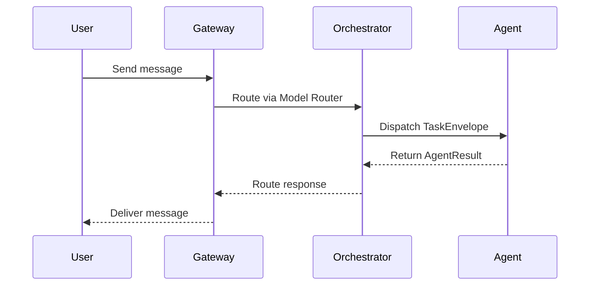
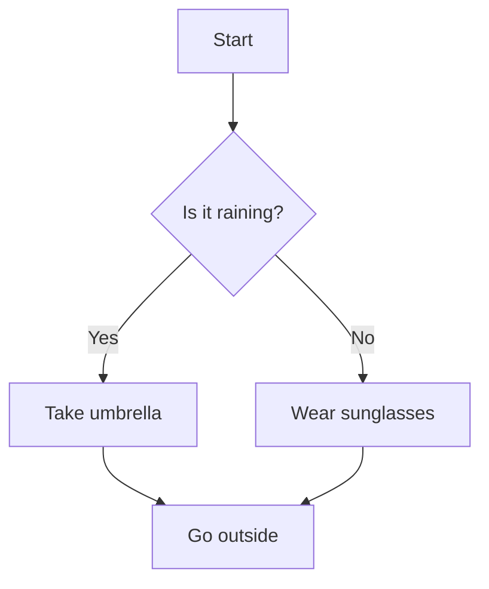
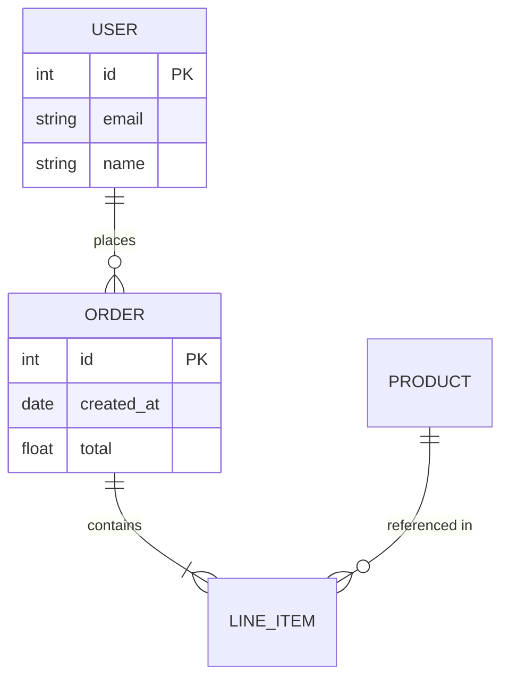
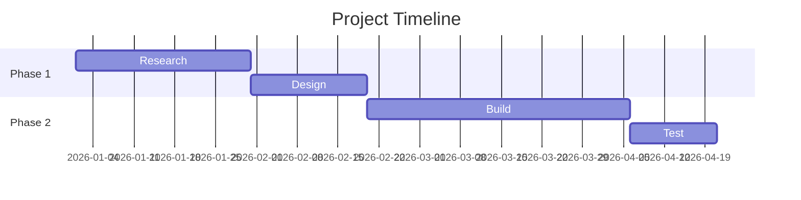
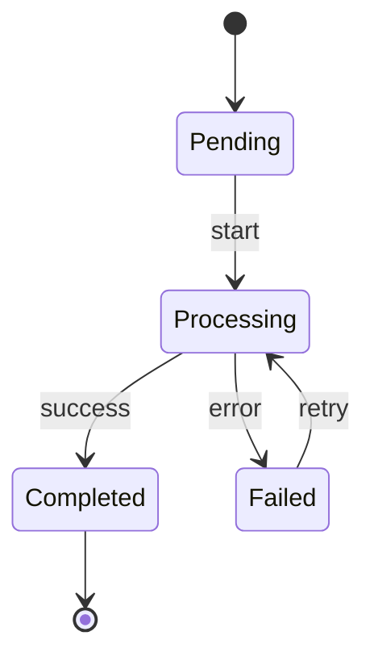
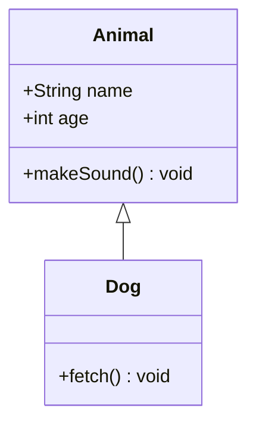

# Mermaid Diagram Skill

## When to Use

Use Mermaid for:
- **Sequence diagrams** — API call flows, request/response patterns, protocol interactions
- **Flowcharts** — decision trees, process flows, algorithm steps
- **ER diagrams** — database entity relationships
- **Gantt charts** — project timelines, sprint planning
- **State diagrams** — state machines, status workflows, lifecycle diagrams
- **Class diagrams** — OOP inheritance, interfaces, associations
- **Git graphs** — branching strategies, release flows
- **Pie charts** — composition breakdowns
- **Quadrant charts** — 2x2 matrix positioning
- **Timelines** — chronological events

Mermaid is the default renderer when no specific style is requested.

## Syntax Reference

### Sequence Diagram

**Key syntax:**
- `participant X as Label` — define participants
- `->>` synchronous call, `-->>` return
- `->` solid line without arrow, `-->` dashed
- `Note over X,Y: text` — annotations
- `alt/else/end` — conditional flows
- `loop N times` — loops
- `par/and` — parallel flows
- `activate X` / `deactivate X` — lifeline activation

### Flowchart

**Node shapes:**
- `[text]` — rectangle
- `(text)` — rounded rectangle
- `{text}`` — diamond (decision)
- `((text))` — circle
- `[/text/]` — parallelogram
- `[[text]]` — subroutine

**Directions:** `TD` (top-down), `LR` (left-right), `RL`, `BT`

### ER Diagram

**Cardinality:**
- `||` exactly one
- `o|` zero or one
- `}|` one or more
- `}o` zero or more

### Gantt Chart

### State Diagram

### Class Diagram

## Rendering

Rendered via `mmdc` CLI (mermaid-cli). Outputs SVG or PNG.
- Install: `npm i -g @mermaid-js/mermaid-cli`
- Command: `mmdc -i input.mmd -o output.svg -b white -t default`

## Best Practices

1. Use `TD` direction for process flows, `LR` for system diagrams
2. Keep node labels concise (2-4 words)
3. Use consistent naming: `participant G as Gateway` not `participant Gateway`
4. Add `%% comments` for complex diagrams
5. For large diagrams, break into subgraphs
6. Use `linkStyle` for coloring important paths
7. Keep sequence diagrams to <15 participants for readability
