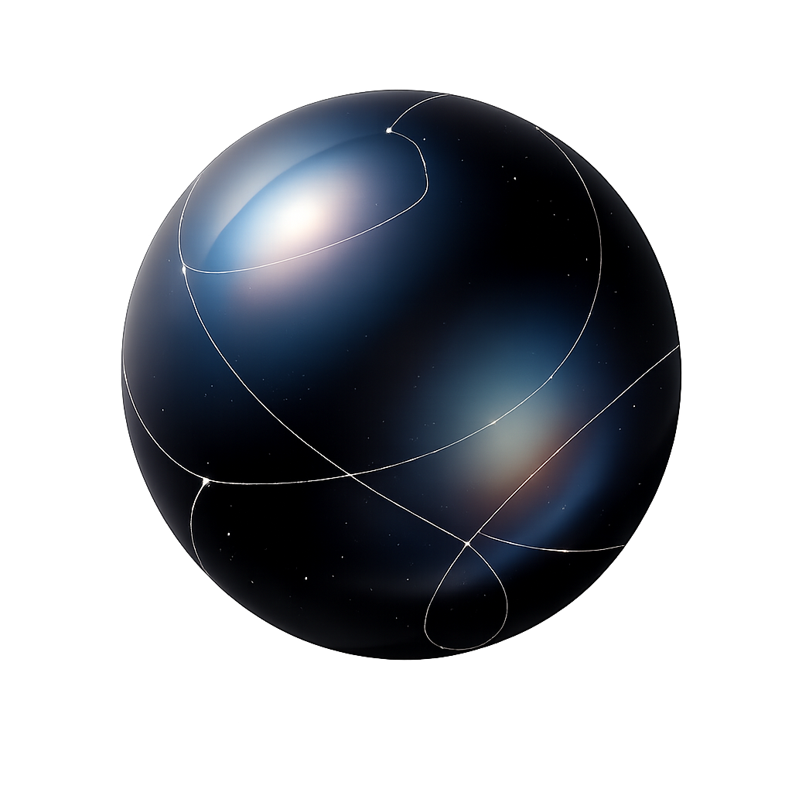

<div align="center">
  

  # Cosmic

  **The proactive AI copilot for knowledge work.**

  Not another chatbot — an assistant that watches, remembers, and acts before you have to ask.

  [cosmic.thelearnchain.com](https://cosmic.thelearnchain.com)

</div>

---

## Why Cosmic

Knowledge workers lose roughly **20% of their time** hunting for answers that already exist somewhere in their own tools, and context-switching between apps costs the global economy an estimated **$1T** a year. Traditional AI assistants only make this worse — they wait for a prompt, answer once, and forget everything the moment the tab closes.

Cosmic is built the other way around. It runs continuously alongside your work, builds a private memory of what you're doing, and proactively surfaces what matters — a meeting recap, a stalled thread that needs a reply, a filing deadline, a suspicious login — without waiting to be asked.

## What it does

- **Proactive intelligence** — a persistent heartbeat loop reasons about your inbox, calendar, and open threads on its own schedule and reaches out when something is actually worth your attention, instead of only responding to prompts.
- **Private memory system** — a graph-backed "digital twin" of your work (built on Neo4j + a vector store) links people, projects, decisions, and documents together, with sub-200ms recall.
- **Deep integrations** — Gmail, Google Calendar, Google Docs/Sheets, Slack-style chat, WhatsApp, Telegram, and web/document research, with more connectors added over time.
- **Real agentic execution** — Cosmic doesn't just answer questions, it delegates to a fleet of specialist agents that actually do the work: drafting and sending email, editing live Google Docs and Sheets, building slide decks and diagrams, running code, scraping the web, generating images, and more.
- **Multi-channel presence** — the same assistant, the same memory, and the same in-flight conversations follow you across the desktop app, email, WhatsApp, and Telegram.
- **Meeting mode** — live transcription, summarization, and action-item extraction.

Cosmic is currently in public beta for Windows, with macOS on the roadmap.

## Architecture

Cosmic-OS is a multi-agent system: a thin orchestrator reasons and delegates, a fleet of independent specialist agents execute, and a shared memory layer keeps everything grounded in what actually happened.

```
                         ┌─────────────────────────┐
                         │   Desktop App (Electron)│
                         │   React + Vite + TS     │
                         └────────────┬────────────┘
                                      │
        WhatsApp / Telegram ──┐       │       ┌── Email (agent-hosted mailbox)
                               ▼      ▼       ▼
                         ┌─────────────────────────┐
                         │        Gateway          │  FastAPI · channel routing
                         │  sessions · credentials  │  request tracing · scheduling
                         │  gmail sync · heartbeat  │  proactive delivery
                         └────────────┬────────────┘
                                      │
                         ┌────────────▼────────────┐
                         │      Orchestrator        │  Claude / GLM-routed reasoning
                         │  tool loop · planning     │  delegates to specialists
                         └────────────┬────────────┘
                                      │
              ┌───────────┬───────────┼───────────┬───────────┐
              ▼           ▼           ▼           ▼           ▼
          Gmail Agent  Calendar    Google Docs  Google Sheets  Alpha Agent
                        Agent       Agent        Agent         (coding/ops)
              ▼           ▼           ▼           ▼           ▼
           Slide Agent  Diagram   Tabular Agent  Map Agent   Image Generator
                        Agent
              ▼           ▼
        Firecrawl Web   X/Twitter   Docs Parser   WhatsApp Bridge
          Scrape          Search      Agent
                         ┌─────────────────────────┐
                         │     Cosmic Memory        │  Neo4j graph + vector store
                         │  entities · episodes      │  durable, queryable "digital
                         │  identity resolution      │  twin" of your work
                         └─────────────────────────┘
```

Every specialist agent is an independently deployable microservice with its own agent card (declared intents, required OAuth scopes, and policies), registered with the gateway and dispatched to over Redis streams. The orchestrator never talks to a third-party API directly — it delegates to the agent that owns that capability, so each integration can evolve independently and fail without taking the rest of the system down.

## Tech stack

| Layer | Stack |
|---|---|
| Desktop app | Electron, React 19, TypeScript, Vite |
| Backend services | Python, FastAPI, asyncio |
| Reasoning | Claude (Anthropic) and Fireworks-hosted GLM/Kimi models |
| Memory | Neo4j (graph) + vector store, deterministic + LLM-assisted extraction |
| Messaging | Redis streams (agent dispatch and events) |
| Storage | SQLite (per-service durable state), Postgres (mail) |
| Deployment | systemd services (`cosmic-backend.target`) |

## Repository layout

```
Cosmic-OS/
├── src/                      # Electron + React desktop app
├── electron/                 # Electron main/preload process
└── Backend/
    ├── gateway/               # FastAPI gateway: channels, sessions, credentials, scheduling
    ├── orchestrator/          # Reasoning core: tool loop, model routing, task ledger
    ├── registry/               # Agent card registry + heartbeat tracking
    ├── shared/                 # Shared contracts, task envelopes, utilities
    ├── bridges/                 # WhatsApp bridge
    ├── agents/
    │   ├── gmail_agent/
    │   ├── calendar_agent/
    │   ├── google_docs_agent/
    │   ├── google_sheets_agent/
    │   ├── alpha_agent/         # coding / operator agent
    │   ├── slide_agent/
    │   ├── diagram_agent/
    │   ├── tabular_agent/
    │   ├── map_agent/
    │   ├── image_generator_agent/
    │   ├── email_agent/
    │   ├── firecrawl_web_scrape/
    │   ├── x_twitter_search/
    │   └── docs_parser/
    ├── systemd/                # systemd unit templates for every service
    └── tests/                  # Cross-service integration tests
```

## Getting started

Cosmic-OS is a distributed system — the desktop app is one piece of it, backed by the gateway, orchestrator, memory service, and a fleet of specialist agents running as independent processes.

```bash
# Desktop app
npm install
npm run dev

# Backend (each service has its own agent.env / .env)
cd Backend
python -m venv .venv && source .venv/bin/activate
pip install -r requirements.txt
python -m gateway.main
python -m orchestrator.main
```

In production, every backend service runs as its own systemd unit under `cosmic-backend.target` (see `Backend/systemd/*.service.example` for unit templates).

## Learn more

Full product overview, feature walkthroughs, and beta access: **[cosmic.thelearnchain.com](https://cosmic.thelearnchain.com)**

## License

No public license is currently granted — all rights reserved. Contact the maintainer for usage or contribution inquiries.
